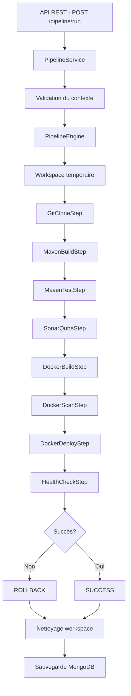

# 🚀 JONK - Moteur de Pipeline CI/CD Custom

> **Moteur de pipeline CI/CD développé from scratch pour le projet Cloud Sécurisé**

[](https://openjdk.java.net/)
[](https://spring.io/projects/spring-boot)
[](https://www.mongodb.com/)
[](https://www.docker.com/)

---

## 📌 Vue d'ensemble

**JONK** est un moteur de pipeline CI/CD personnalisé développé **entièrement from scratch**, sans utiliser Jenkins, GitHub Actions, GitLab CI ou tout autre outil CI/CD existant. 

Ce projet démontre la compréhension profonde des concepts CI/CD en implémentant :
- ✅ Orchestration de pipeline multi-étapes
- ✅ Exécution de commandes système réelles (git, maven, docker, ssh)
- ✅ Gestion des erreurs et rollback automatique
- ✅ API REST pour déclencher et suivre les pipelines
- ✅ Persistance MongoDB pour l'historique
- ✅ Sécurité OAuth2 / Keycloak (prêt pour intégration)
- ✅ Exécution asynchrone multi-pipeline

---


## 🚀 Démarrage rapide

### Prérequis

```bash
# Vérifier les versions
java --version        # Java 21+
mvn --version         # Maven 3.8+
docker --version      # Docker 20+
git --version         # Git 2+
node --version        # Node 24.12

# Optionnel
trivy --version       # Scan de sécurité
```

### Installation du dorsal

1. **Ajouter le domaine à votre hostfile**
   - Sur Windows : C:\Windows\System32\drivers\etc\hosts
   - Sur Linux : /etc/hosts

```bash
127.0.0.1 jonk.local.fr
```

2. **Démarrer les conteneurs Docker**

```bash
cd docker-dev-env
docker compose up -d
```

3. **Configurer le jeton SonarQube**
   - Se rendre sur http://localhost:9000
   - L'identifiant par défaut est admin:admin
   - Cliquer sur l'icône du profil en haut à droite -> My Account -> Security
   - Générer un nouveau jeton
   - Copier le jeton vers src/main/resources/application-dev.yml dans le champ jonk.sonarqube.token

4. **Compiler et lancer**
```bash
mvn clean install
mvn spring-boot:run -Dprofile.active=dev
```

L'application démarre sur **http://localhost:8080**


---

## 🏗️ Architecture

### Flux d'exécution



---

## 🧱 Composants principaux

### 1️⃣ PipelineEngine
**Rôle** : Orchestrateur central du pipeline

**Responsabilités** :
- Exécution séquentielle des étapes
- Gestion du workspace temporaire
- Arrêt du pipeline en cas d'échec
- Déclenchement du rollback automatique
- Nettoyage des ressources

**Méthodes clés** :
- `executePipeline(context, steps)` : Lance le pipeline
- `prepareWorkspace()` : Crée un workspace isolé
- `performRollback()` : Rollback des étapes critiques
- `cleanupWorkspace()` : Nettoyage post-exécution

### 2️⃣ PipelineStep (Interface)
**Contrat** pour toutes les étapes du pipeline

```java
public interface PipelineStep {
    String getName();
    StepResult execute(PipelineContext context) throws Exception;
    void rollback(PipelineContext context) throws Exception;
    boolean isCritical(); // Détermine si l'échec déclenche un rollback
}
```

### 3️⃣ PipelineContext
**Contexte partagé** entre toutes les étapes

Contient :
- Configuration Git (URL, branche, commit)
- Configuration Docker (image, registry, tag)
- Configuration déploiement (SSH, host, port)
- Configuration SonarQube (URL, token, project key)
- Variables d'environnement
- Workspace temporaire

### 4️⃣ Étapes du Pipeline

| Étape | Description | Critique | Rollback |
|-------|-------------|----------|----------|
| **GitCloneStep** | Clone du repository | ✅ | Supprime le workspace |
| **MavenBuildStep** | Compilation du projet | ✅ | - |
| **MavenTestStep** | Tests unitaires | ✅ | - |
| **SonarQubeStep** | Analyse qualité code | ❌ | - |
| **DockerBuildStep** | Build image Docker | ✅ | - |
| **DockerScanStep** | Scan sécurité (Trivy) | ❌ | - |
| **DockerDeployStep** | Déploiement container | ✅ | Redéploie version précédente |
| **HealthCheckStep** | Vérification santé app | ✅ | - |

---

## 🔧 Technologies utilisées

### Backend
- **Spring Boot 3.5.9** - Framework applicatif
- **Java 21** - Langage de programmation
- **MongoDB** - Base de données NoSQL pour persistance
- **Spring Security + OAuth2** - Sécurisation des endpoints
- **Lombok** - Réduction du boilerplate

### Outils externes (exécutés via ProcessBuilder)
- **Git** - Clone de repositories
- **Maven** - Build et tests Java
- **Docker** - Build et déploiement d'images
- **Trivy** (optionnel) - Scan de sécurité
- **SonarQube** (optionnel) - Analyse de qualité
- **SSH/SCP** - Déploiement distant

---

## 🔄 Gestion du Rollback

### Stratégie implémentée

En cas d'échec d'une **étape critique** :

1. **Arrêt immédiat** du pipeline
2. **Exécution du rollback** des étapes déjà réussies (ordre inverse)
3. **Nettoyage** des ressources

### Exemple de rollback

Si le **HealthCheckStep** échoue :
1. Arrêt du nouveau container
2. Suppression de l'image Docker
3. Nettoyage du workspace
4. Statut : `ROLLED_BACK`

### Étapes critiques vs non-critiques

- **Critiques** : GitClone, MavenBuild, MavenTest, DockerBuild, DockerDeploy, HealthCheck
- **Non-critiques** : SonarQube, DockerScan (n'arrêtent pas le pipeline)

---

## 📊 Monitoring et Logs

### Logs console
Tous les logs sont affichés avec emojis pour une lecture facile :
```
🚀 Démarrage du pipeline: a1b2c3d4-...
📁 Repository: https://github.com/...
🔀 Branche: main
▶️  Exécution de l'étape: Git Clone
✅ Étape 'Git Clone' terminée avec succès en 2340ms
```

### Logs dans MongoDB
Chaque exécution est persistée avec :
- Métadonnées (repo, branche, commit, utilisateur)
- Statut global
- Résultat de chaque étape
- Logs détaillés par étape
- Durée d'exécution

---

## 🧪 Tests

### Lancer les tests
```bash
mvn test
```

### Tester manuellement un pipeline
```bash
# 1. Lancer un pipeline
EXECUTION_ID=$(curl -X POST http://localhost:8080/api/pipeline/run \
  -H "Content-Type: application/json" \
  -d '{"gitUrl":"https://github.com/spring-projects/spring-petclinic.git","branch":"main","dockerImageName":"test-app","deploymentPort":"8090","triggeredBy":"test"}' \
  | jq -r '.executionId')

# 2. Suivre l'exécution
watch -n 2 "curl -s http://localhost:8080/api/pipeline/$EXECUTION_ID | jq '.status'"

# 3. Récupérer les logs
curl -s http://localhost:8080/api/pipeline/$EXECUTION_ID/logs | jq -r '.logs[]'
```

---

## 📦 Build et déploiement de l'application
```bash
mvn clean package -DskipTests
java -jar target/demo-0.0.1-SNAPSHOT.jar
```


## ⚠️ Limitations connues

1. **Rollback partiel** : Seules certaines étapes supportent le rollback
2. **Pas de cache de build** : Chaque build repart de zéro
3. **Logs en mémoire** : Risque de saturation pour des pipelines très longs
4. **Déploiement SSH basique** : Pas de gestion avancée des erreurs réseau

---

## 🔮 Évolutions futures

- [ ] **WebSocket** pour les logs temps réel
- [ ] **Parallélisation** des étapes indépendantes
- [ ] **Cache Maven/Docker** pour accélérer les builds
- [ ] **Support Kubernetes** pour le déploiement
- [ ] **Intégration GitLab Webhooks** pour déclenchement automatique
- [ ] **Dashboard Web** avec React/Angular
- [ ] **Notifications** (email, Slack, Discord)

---
