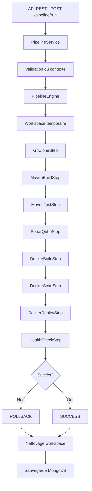

# 🚀 JONK - Moteur de Pipeline CI/CD Custom

> **Moteur de pipeline CI/CD développé from scratch pour le projet Cloud Sécurisé**

[](https://openjdk.java.net/)
[](https://spring.io/projects/spring-boot)
[](https://www.mongodb.com/)
[](https://www.docker.com/)

---

## 📌 Vue d'ensemble

**JONK** est un moteur de pipeline CI/CD personnalisé développé **entièrement from scratch**, sans utiliser Jenkins, GitHub Actions, GitLab CI ou tout autre outil CI/CD existant. 

Ce projet démontre la compréhension profonde des concepts CI/CD en implémentant :
- ✅ Orchestration de pipeline multi-étapes
- ✅ Exécution de commandes système réelles (git, maven, docker, ssh)
- ✅ Gestion avancée des erreurs et rollback automatique
- ✅ API REST pour déclencher et suivre les pipelines
- ✅ Persistance MongoDB pour l'historique
- ✅ Sécurité OAuth2 / Keycloak (prêt pour intégration)
- ✅ Exécution asynchrone multi-pipeline

---

## 🏗️ Architecture

### Structure du projet

```
jonk/
├── src/main/java/com/imt/demo/
│   ├── controller/          # API REST
│   │   └── PipelineController.java
│   ├── service/             # Logique métier
│   │   └── PipelineService.java
│   ├── engine/              # Cœur du moteur CI/CD
│   │   └── PipelineEngine.java
│   ├── steps/               # Étapes modulaires du pipeline
│   │   ├── AbstractPipelineStep.java
│   │   ├── PipelineStep.java (interface)
│   │   ├── GitCloneStep.java
│   │   ├── MavenBuildStep.java
│   │   ├── MavenTestStep.java
│   │   ├── SonarQubeStep.java
│   │   ├── DockerBuildStep.java
│   │   ├── DockerScanStep.java
│   │   ├── DockerDeployStep.java
│   │   └── HealthCheckStep.java
│   ├── model/               # Modèles de données
│   │   ├── PipelineContext.java
│   │   ├── PipelineExecution.java
│   │   ├── PipelineStatus.java
│   │   ├── StepResult.java
│   │   └── StepStatus.java
│   ├── repository/          # Persistance MongoDB
│   │   └── PipelineExecutionRepository.java
│   ├── dto/                 # Data Transfer Objects
│   │   ├── PipelineRequest.java
│   │   └── PipelineResponse.java
│   └── config/              # Configuration
│       ├── SecurityConfig.java
│       └── AsyncConfig.java
└── src/main/resources/
    └── application.properties
```

### Flux d'exécution



---

## 🧱 Composants principaux

### 1️⃣ PipelineEngine
**Rôle** : Orchestrateur central du pipeline

**Responsabilités** :
- Exécution séquentielle des étapes
- Gestion du workspace temporaire
- Arrêt du pipeline en cas d'échec
- Déclenchement du rollback automatique
- Nettoyage des ressources

**Méthodes clés** :
- `executePipeline(context, steps)` : Lance le pipeline
- `prepareWorkspace()` : Crée un workspace isolé
- `performRollback()` : Rollback des étapes critiques
- `cleanupWorkspace()` : Nettoyage post-exécution

### 2️⃣ PipelineStep (Interface)
**Contrat** pour toutes les étapes du pipeline

```java
public interface PipelineStep {
    String getName();
    StepResult execute(PipelineContext context) throws Exception;
    void rollback(PipelineContext context) throws Exception;
    boolean isCritical(); // Détermine si l'échec déclenche un rollback
}
```

### 3️⃣ PipelineContext
**Contexte partagé** entre toutes les étapes

Contient :
- Configuration Git (URL, branche, commit)
- Configuration Docker (image, registry, tag)
- Configuration déploiement (SSH, host, port)
- Configuration SonarQube (URL, token, project key)
- Variables d'environnement
- Workspace temporaire

### 4️⃣ Étapes du Pipeline

| Étape | Description | Critique | Rollback |
|-------|-------------|----------|----------|
| **GitCloneStep** | Clone du repository | ✅ | Supprime le workspace |
| **MavenBuildStep** | Compilation du projet | ✅ | - |
| **MavenTestStep** | Tests unitaires | ✅ | - |
| **SonarQubeStep** | Analyse qualité code | ❌ | - |
| **DockerBuildStep** | Build image Docker | ✅ | - |
| **DockerScanStep** | Scan sécurité (Trivy) | ❌ | - |
| **DockerDeployStep** | Déploiement container | ✅ | Redéploie version précédente |
| **HealthCheckStep** | Vérification santé app | ✅ | - |

---

## 🔧 Technologies utilisées

### Backend
- **Spring Boot 3.5.9** - Framework applicatif
- **Java 21** - Langage de programmation
- **MongoDB** - Base de données NoSQL pour persistance
- **Spring Security + OAuth2** - Sécurisation des endpoints
- **Lombok** - Réduction du boilerplate

### Outils externes (exécutés via ProcessBuilder)
- **Git** - Clone de repositories
- **Maven** - Build et tests Java
- **Docker** - Build et déploiement d'images
- **Trivy** (optionnel) - Scan de sécurité
- **SonarQube** (optionnel) - Analyse de qualité
- **SSH/SCP** - Déploiement distant

---

## 🚀 Démarrage rapide

### Prérequis

```bash
# Vérifier les versions
java --version        # Java 21+
mvn --version         # Maven 3.8+
docker --version      # Docker 20+
mongod --version      # MongoDB 5+

# Optionnel
trivy --version       # Scan de sécurité
```

### Installation

1. **Cloner le projet**
```bash
git clone <votre-repo>
cd jonk
```

2. **Démarrer MongoDB**
```bash
# Avec Docker
docker run -d -p 27017:27017 --name mongodb mongo:latest

# Ou avec MongoDB local
mongod
```

3. **Configurer l'application**
```bash
# Éditer src/main/resources/application.properties
# Vérifier la connexion MongoDB
```

4. **Compiler et lancer**
```bash
mvn clean install
mvn spring-boot:run
```

L'application démarre sur **http://localhost:8080**

---

## 📡 API REST

### Endpoints disponibles

#### 1. Health Check
```bash
GET /api/pipeline/health
```
Vérification que l'API fonctionne.

#### 2. Lancer un pipeline
```bash
POST /api/pipeline/run
Content-Type: application/json

{
  "gitUrl": "https://github.com/username/repo.git",
  "branch": "main",
  "dockerImageName": "my-app",
  "dockerImageTag": "v1.0.0",
  "deploymentPort": "8081",
  "triggeredBy": "john.doe"
}
```

**Réponse** :
```json
{
  "executionId": "a1b2c3d4-e5f6-7890-abcd-ef1234567890",
  "message": "Pipeline démarré avec succès",
  "status": "RUNNING"
}
```

#### 3. Consulter un pipeline
```bash
GET /api/pipeline/{executionId}
```

**Réponse** :
```json
{
  "executionId": "...",
  "gitRepoUrl": "https://github.com/...",
  "status": "SUCCESS",
  "startTime": "2026-01-05T10:30:00",
  "endTime": "2026-01-05T10:35:00",
  "durationMs": 300000,
  "totalSteps": 8,
  "successSteps": 8,
  "failedSteps": 0
}
```

#### 4. Récupérer les logs
```bash
GET /api/pipeline/{executionId}/logs
```

#### 5. Lister les exécutions récentes
```bash
GET /api/pipeline/executions
```

#### 6. Annuler un pipeline
```bash
POST /api/pipeline/{executionId}/cancel
```

---

## 📋 Exemples de requêtes

### 1. Pipeline complet avec SonarQube
```bash
curl -X POST http://localhost:8080/api/pipeline/run \
  -H "Content-Type: application/json" \
  -d '{
    "gitUrl": "https://github.com/spring-projects/spring-petclinic.git",
    "branch": "main",
    "dockerImageName": "petclinic",
    "dockerImageTag": "latest",
    "sonarQubeUrl": "http://localhost:9000",
    "sonarQubeToken": "sqp_xxxxx",
    "deploymentPort": "8082",
    "triggeredBy": "admin"
  }'
```

### 2. Pipeline simple (local)
```bash
curl -X POST http://localhost:8080/api/pipeline/run \
  -H "Content-Type: application/json" \
  -d '{
    "gitUrl": "https://github.com/username/simple-app.git",
    "branch": "develop",
    "dockerImageName": "simple-app",
    "deploymentPort": "8083",
    "triggeredBy": "dev.user"
  }'
```

### 3. Pipeline avec déploiement distant
```bash
curl -X POST http://localhost:8080/api/pipeline/run \
  -H "Content-Type: application/json" \
  -d '{
    "gitUrl": "https://github.com/username/prod-app.git",
    "branch": "production",
    "dockerImageName": "prod-app",
    "dockerImageTag": "v2.0.0",
    "deploymentHost": "192.168.1.100",
    "deploymentUser": "deploy",
    "deploymentPort": "8080",
    "sshKeyPath": "/home/user/.ssh/id_rsa",
    "triggeredBy": "admin"
  }'
```

---

## 🔐 Sécurité

### OAuth2 / Keycloak (Prêt à l'emploi)

Le code est préparé pour OAuth2 avec Keycloak :

1. **Configurer Keycloak**
```properties
# application.properties
spring.security.oauth2.resourceserver.jwt.issuer-uri=http://localhost:8180/realms/jonk
```

2. **Créer un realm "jonk"** avec 3 rôles :
   - `ADMIN` : Tous les droits
   - `DEV` : Lancer et consulter pipelines
   - `VIEWER` : Consulter uniquement

3. **Requêtes authentifiées**
```bash
curl -X POST http://localhost:8080/api/pipeline/run \
  -H "Authorization: Bearer <JWT_TOKEN>" \
  -H "Content-Type: application/json" \
  -d '...'
```

### Désactiver temporairement OAuth2

Pour les tests locaux, commenter dans `SecurityConfig.java` :
```java
// .oauth2ResourceServer(...)
```

---

## 🔄 Gestion du Rollback

### Stratégie implémentée

En cas d'échec d'une **étape critique** :

1. **Arrêt immédiat** du pipeline
2. **Exécution du rollback** des étapes déjà réussies (ordre inverse)
3. **Nettoyage** des ressources

### Exemple de rollback

Si le **HealthCheckStep** échoue :
1. Arrêt du nouveau container
2. Suppression de l'image Docker
3. Nettoyage du workspace
4. Statut : `ROLLED_BACK`

### Étapes critiques vs non-critiques

- **Critiques** : GitClone, MavenBuild, MavenTest, DockerBuild, DockerDeploy, HealthCheck
- **Non-critiques** : SonarQube, DockerScan (n'arrêtent pas le pipeline)

---

## 📊 Monitoring et Logs

### Logs console
Tous les logs sont affichés avec emojis pour une lecture facile :
```
🚀 Démarrage du pipeline: a1b2c3d4-...
📁 Repository: https://github.com/...
🔀 Branche: main
▶️  Exécution de l'étape: Git Clone
✅ Étape 'Git Clone' terminée avec succès en 2340ms
```

### Logs dans MongoDB
Chaque exécution est persistée avec :
- Métadonnées (repo, branche, commit, utilisateur)
- Statut global
- Résultat de chaque étape
- Logs détaillés par étape
- Durée d'exécution

---

## 🧪 Tests

### Lancer les tests
```bash
mvn test
```

### Tester manuellement un pipeline
```bash
# 1. Lancer un pipeline
EXECUTION_ID=$(curl -X POST http://localhost:8080/api/pipeline/run \
  -H "Content-Type: application/json" \
  -d '{"gitUrl":"https://github.com/spring-projects/spring-petclinic.git","branch":"main","dockerImageName":"test-app","deploymentPort":"8090","triggeredBy":"test"}' \
  | jq -r '.executionId')

# 2. Suivre l'exécution
watch -n 2 "curl -s http://localhost:8080/api/pipeline/$EXECUTION_ID | jq '.status'"

# 3. Récupérer les logs
curl -s http://localhost:8080/api/pipeline/$EXECUTION_ID/logs | jq -r '.logs[]'
```

---

## 📦 Déploiement

### Build de l'application
```bash
mvn clean package -DskipTests
java -jar target/demo-0.0.1-SNAPSHOT.jar
```

### Dockerisation de JONK
```dockerfile
FROM openjdk:21-jdk-slim
WORKDIR /app
COPY target/*.jar app.jar
EXPOSE 8080
ENTRYPOINT ["java", "-jar", "app.jar"]
```

```bash
docker build -t jonk-cicd-engine .
docker run -d -p 8080:8080 --name jonk jonk-cicd-engine
```

---

## 🎯 Choix techniques justifiés

### 1. Pourquoi Spring Boot ?
- ✅ Écosystème mature et complet
- ✅ Injection de dépendances native
- ✅ Sécurité OAuth2 intégrée
- ✅ Exécution asynchrone avec `@Async`

### 2. Pourquoi MongoDB ?
- ✅ Structure flexible (logs de taille variable)
- ✅ Requêtes rapides sur les métadonnées
- ✅ Scalabilité horizontale
- ✅ Pas de schéma rigide

### 3. Pourquoi ProcessBuilder ?
- ✅ Contrôle total sur les commandes système
- ✅ Capture stdout/stderr en temps réel
- ✅ Gestion des codes de sortie
- ✅ Variables d'environnement personnalisables

### 4. Pourquoi une architecture modulaire ?
- ✅ Ajout facile de nouvelles étapes
- ✅ Réutilisabilité du code
- ✅ Tests unitaires simplifiés
- ✅ Maintenance facilitée

---

## ⚠️ Limitations connues

1. **Pas de parallélisation des étapes** : Les étapes sont séquentielles
2. **Rollback partiel** : Seules certaines étapes supportent le rollback
3. **Pas de cache de build** : Chaque build repart de zéro
4. **Logs en mémoire** : Risque de saturation pour des pipelines très longs
5. **Déploiement SSH basique** : Pas de gestion avancée des erreurs réseau

---

## 🔮 Évolutions futures

- [ ] **WebSocket** pour les logs temps réel
- [ ] **Parallélisation** des étapes indépendantes
- [ ] **Cache Maven/Docker** pour accélérer les builds
- [ ] **Support Kubernetes** pour le déploiement
- [ ] **Intégration GitLab Webhooks** pour déclenchement automatique
- [ ] **Dashboard Web** avec React/Angular
- [ ] **Notifications** (email, Slack, Discord)

---

## 📚 Ressources

- [Documentation Spring Boot](https://spring.io/projects/spring-boot)
- [ProcessBuilder Java](https://docs.oracle.com/en/java/javase/21/docs/api/java.base/java/lang/ProcessBuilder.html)
- [MongoDB avec Spring](https://spring.io/guides/gs/accessing-data-mongodb)
- [Spring Security OAuth2](https://docs.spring.io/spring-security/reference/servlet/oauth2/resource-server/index.html)

---

## 👥 Auteur

**Projet académique Cloud Sécurisé - IMT**

---

## 📄 Licence

Ce projet est développé dans un cadre pédagogique.

---

## 🎤 Pour la soutenance (15 min)

### Plan suggéré :
1. **Introduction** (2 min) : Contexte et objectifs
2. **Architecture** (3 min) : Schéma + composants clés
3. **Démo live** (5 min) : Lancer un pipeline complet
4. **Choix techniques** (3 min) : Justification
5. **Conclusion** (2 min) : Limitations et évolutions

### Démo à préparer :
```bash
# 1. Montrer l'API health
curl http://localhost:8080/api/pipeline/health

# 2. Lancer un pipeline
curl -X POST http://localhost:8080/api/pipeline/run -H "Content-Type: application/json" -d @examples/request-simple.json

# 3. Suivre l'exécution dans les logs console

# 4. Montrer les logs dans MongoDB ou via l'API

# 5. Montrer un cas d'échec + rollback
```

---

**🚀 JONK - Because we build pipelines, not excuses!**
